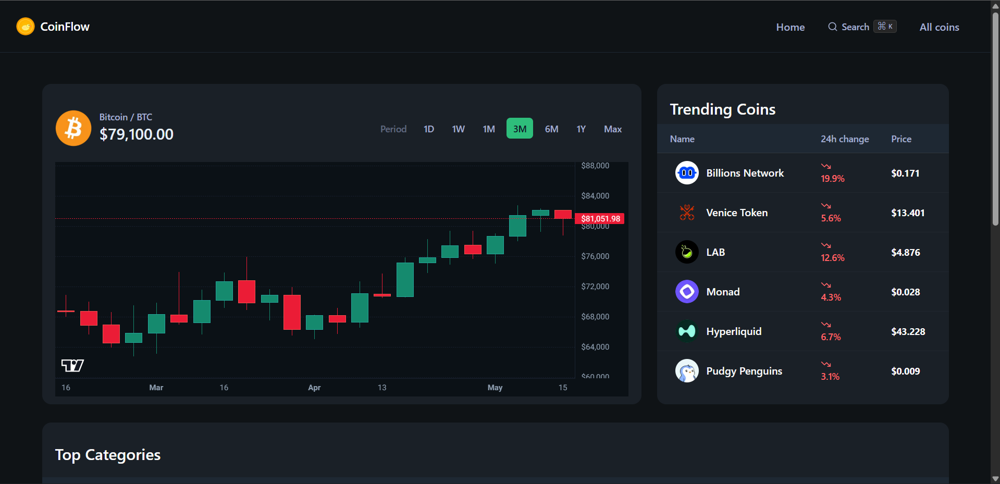
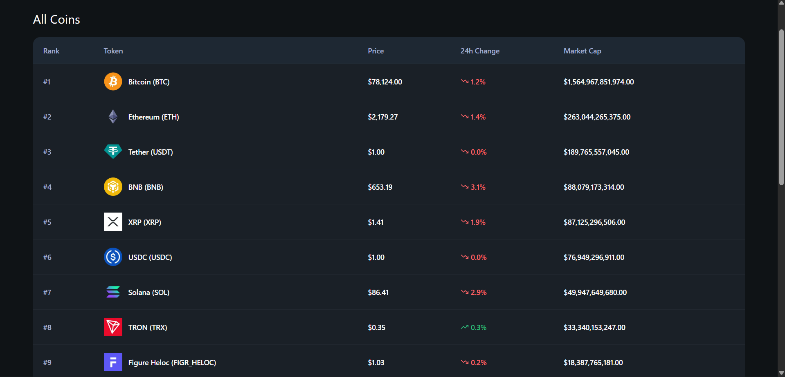
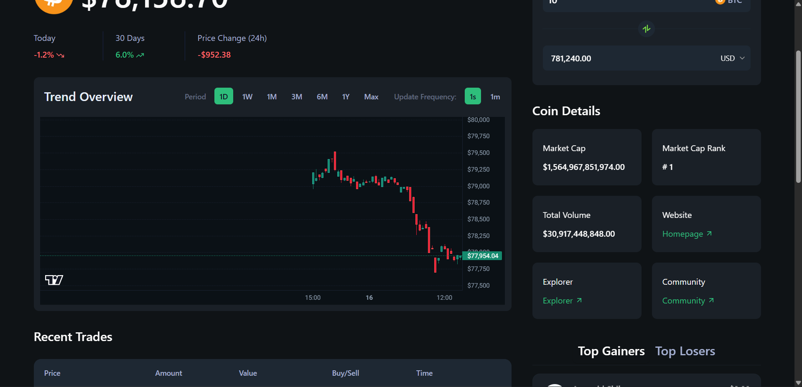

<p align="center">
	
</p>

<h1 align="center">CoinFlow</h1>

<p align="center">
	A real-time crypto dashboard for tracking coins, viewing charts, and exploring market data.
</p>

<p align="center">
	<a href="https://coinflow.cobweb.id.vn/"><strong>Live Demo</strong></a>
</p>

<p align="center">
	
	
	
	
</p>

## Tech Stack

- **Framework:** Next.js 16 (App Router)
- **Language:** TypeScript
- **UI:** Tailwind CSS v4 + shadcn/ui (Radix UI)
- **Data fetching:** SWR
- **Charts:** lightweight-charts (candlestick)
- **APIs:** CoinGecko REST API
- **Realtime:** OKX Public WebSocket

## Key Features

- Coin list with key metrics (price, 24h change, market cap)
- Coin detail page with candlestick chart + market info
- Realtime ticker / trades updates via WebSocket
- Quick search modal with keyboard shortcut
- Simple converter widget

## Screenshots / GIF

**Home**



**All Coins**



**Coin Details**



## Getting Started

### Prerequisites

- Node.js 18.18+ (recommended)
- A CoinGecko API key

### Installation

```bash
# 1) Clone
git clone <YOUR_REPO_URL>

# 2) Install dependencies
npm install

# 3) Create env file
cp .env.example .env.local

# 4) Start dev server
npm run dev
```

On Windows (PowerShell):

```powershell
Copy-Item .env.example .env.local
npm install
npm run dev
```

Open http://localhost:3000

> Optional (faster dev): `npm run dev -- --turbo`

## Environment Variables

This project expects the following variables (see `.env.example`):

| Name                 | Required | Description                               |
| -------------------- | -------- | ----------------------------------------- |
| `COINGECKO_BASE_URL` | Yes      | CoinGecko REST base URL                   |
| `COINGECKO_API_KEY`  | Yes      | CoinGecko API key used in server requests |

## Scripts

- `npm run dev` – start development server
- `npm run build` – production build
- `npm run start` – run production server
- `npm run lint` – lint
- `npm run format` – format with Prettier

## Contributing

Issues and pull requests are welcome.

- Fork the repo
- Create a feature branch
- Open a PR with a clear description and screenshots if UI changes

## Acknowledgements

- Data powered by CoinGecko
- Realtime market streams from OKX Public WebSocket
